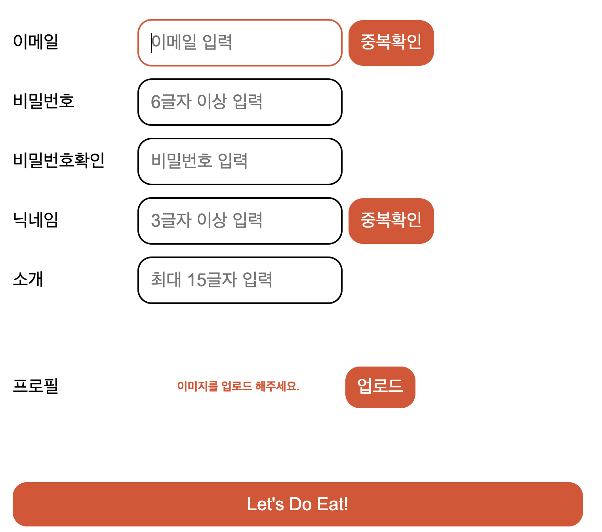
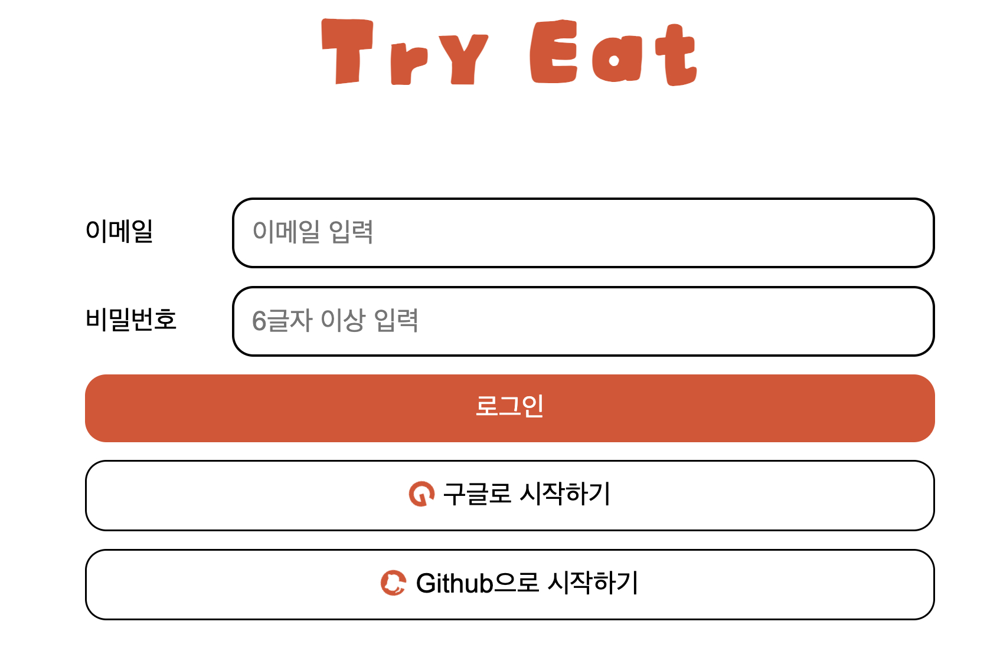
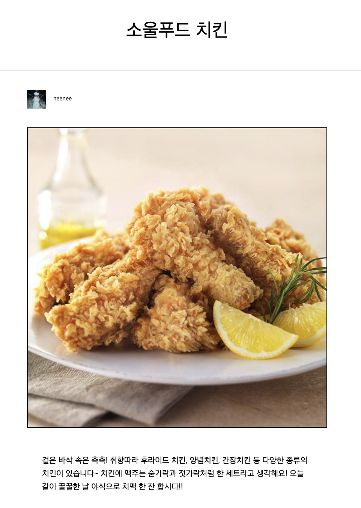
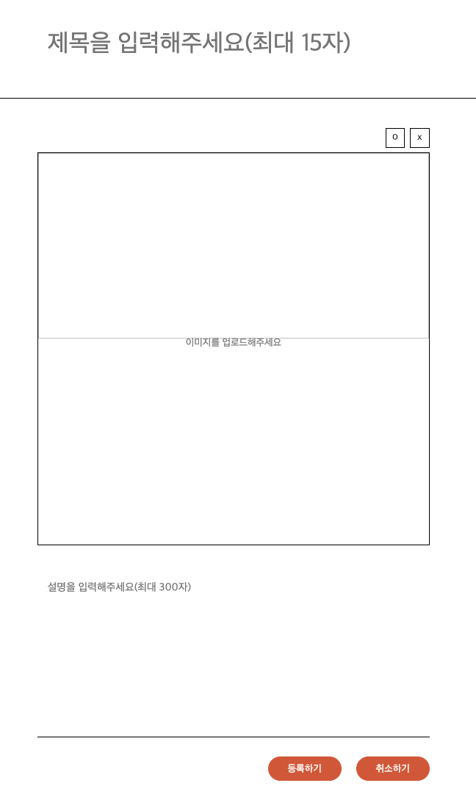
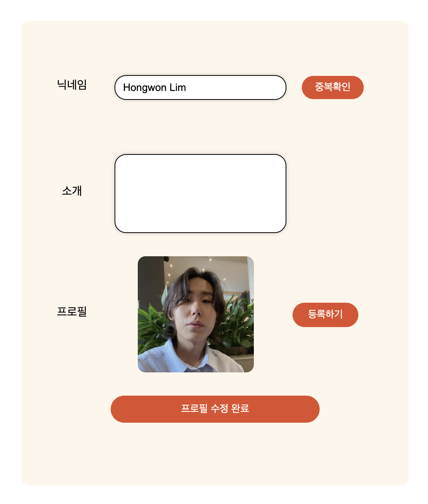

# 내일배움캠프 8주차 팀 프로젝트
<b>프로젝트명</b> 
Try Eat  

<b>프로젝트 내용</b> 
자신맛의 맛집을 소개하고 사람들과 소통 할 수 있는 SNS 서비스  

<b>개발 일정</b> 
2023.11.21 - 2023.11.27  

<b>사용 스택</b> 
  

# 페이지 설명

## 메인

## 회원가입

## 로그인

## 상세정보

## 글등록

## 마이페이지

## 프로필수정

